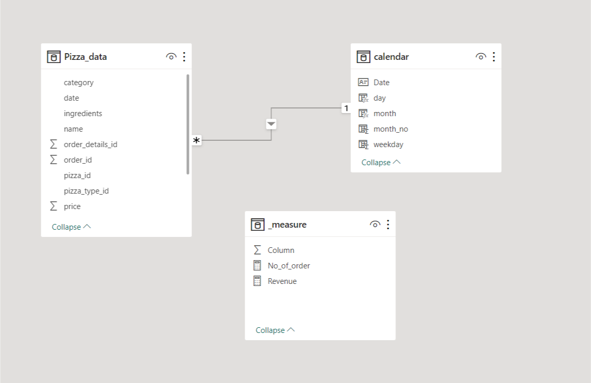
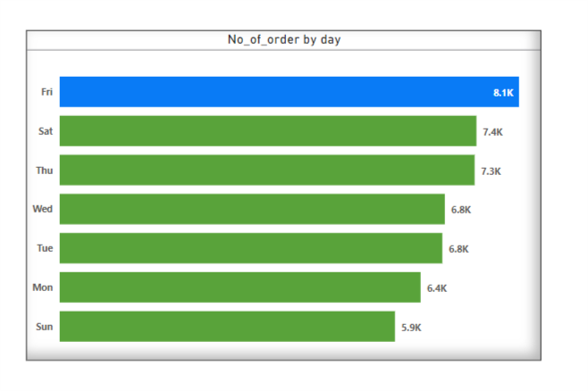
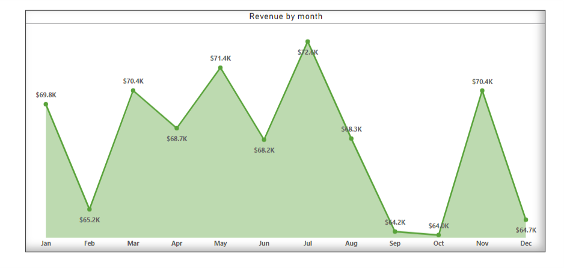
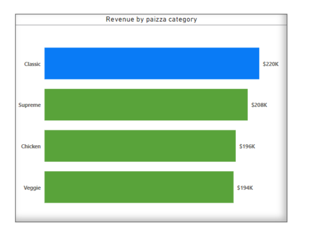
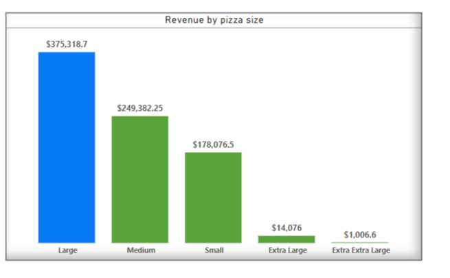

## INTRODUCTION
This is a Power BI project on Pizza Sales analysis of an imaginary store called **Pizza Resturant**. The dataset has Thirteen fields with more than forty-six entries.
The project is to analysis and derive insights to answer crucial questions and help the store make data driven decisions.

**_Disclamer_**: _All dataset and report do not represent any company, institution or country, but just a dummy  to demonstrate capability of Power BI._

## PROBLEM STATEMENT
1.	Find the total revenue generated
2.	Which day of the week has highest number of sales?
3.	Month that generated highest number of revenue
4.	The type of Pizza that has highest number of orders.

## SKILLS/ CONCEPT DEMONSTRATED
The following power bi features were incorporated ;
- DAX,
- Filter,
- Tooltips,
- Button
- Measure
- Modelling

## MODELLING
I created Calendar table using DAX function and connected it with dataset with the common column of Month as showed below

## Visualization
The report contains just one page visuals with many tiles that answers many questions

## ANALYSIS

The revenue generated was more than Eight Hundred Thousand Dollars, with total order of Forty-Eight Thousand Six Hundred and Twenty of different size and category of pizza.

#### DAY
In all the days of week, it was Friday that has highest number of order and the biggest sales among all days.

### MONTH

July has highest number of revenue generated while October is the month of lowest revenue generated.

### CATEGORY

There were four category of pizza in the restaurant, while Veggie type has lowest generation in term of revenue, Classic type generated the highest revenue among them.

### SIZE
Majority of customers preferred Large size of pizza , followed by Medium size while few customers preferred Extra Extra Large size.

The whole report can be interact with by using the [here](https://app.powerbi.com/groups/me/reports/1635ca90-4343-4f40-b680-b0bfb25927e2/ReportSection153e21f348f946273aca?experience=power-bi)

